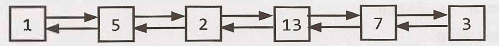

# data-structure

## LinkedList

É um tipo de estrutura de dados que representa uma sequência de <b>nós</b>.

Em uma <b>singly linked list</b> cada nó aponta para o próximo nó na linked list. Ja na <b>double linked list</b> cada nó aponta para o próximo mas também para o nó anterior.

Abaixo o desenho de uma double linked list:

* Tempo constante para inserir e remover itens.
* Ao contrário do array, para acessar um item em determinada posição, o tempo é linear.

## Stack

//...

## Queue

//...